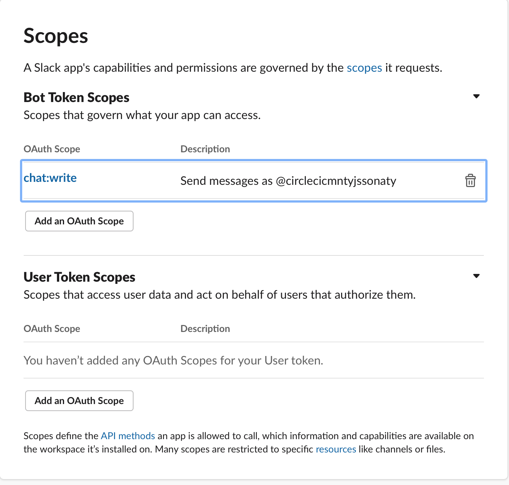

CI Debug Notes
================
To validate some circleci stuff, I was able to run a “build locally” using the steps below.
The local build runs in a docker container.

  * (Once) Install circleci client (`brew install circleci`)

  * Convert the “real” config.yml into a self contained (non-workspace) config via:

        circleci config process .circleci/config.yml > .circleci/local-config.yml

  * Run a local build with the following command:
          
        circleci local execute -c .circleci/local-config.yml 'build'

    Typically, both commands are run together:
    
        circleci config process .circleci/config.yml > .circleci/local-config.yml && circleci local execute -c .circleci/local-config.yml 'build'
    
    With the above command, operations that cannot occur during a local build will show an error like this:
     
      ```
      ... Error: FAILED with error not supported
      ```
    
      However, the build will proceed and can complete “successfully”, which allows you to verify scripts in your config, etc.
      
      If the build does complete successfully, you should see a happy yellow `Success!` message.

Misc
====

* Slack notification setup notes.

    1. Add slack orb to CI config. see: https://circleci.com/developer/orbs/orb/circleci/slack
    2. Create new Slack app ("From Scratch") with Permissions: `chat:write` scope access. 
       
       see: https://github.com/CircleCI-Public/slack-orb/wiki/Setup

       
       
       Install the app to your desired workspace.
       
       Create a context (`slack_community_oss_fun`, with/or Environment Variables: `SLACK_ACCESS_TOKEN`, `SLACK_DEFAULT_CHANNEL`) 
       on CircleCI with the slack token and channelId.
    3. [Install the app](https://slack.com/help/articles/202035138-Add-apps-to-your-Slack-workspace)
    4. [Invite this new Slack app bot user to the channel](https://www.ibm.com/docs/en/SS3GDX_1.1.0/chatops_prerequisite_invite_app_to_channel.html)
       that will receive notifications. e.g. In the channel, post the message: `@CircleCI-cmnty-js-sona-types`, follow
       the prompts to invite the bot user to the channel.
